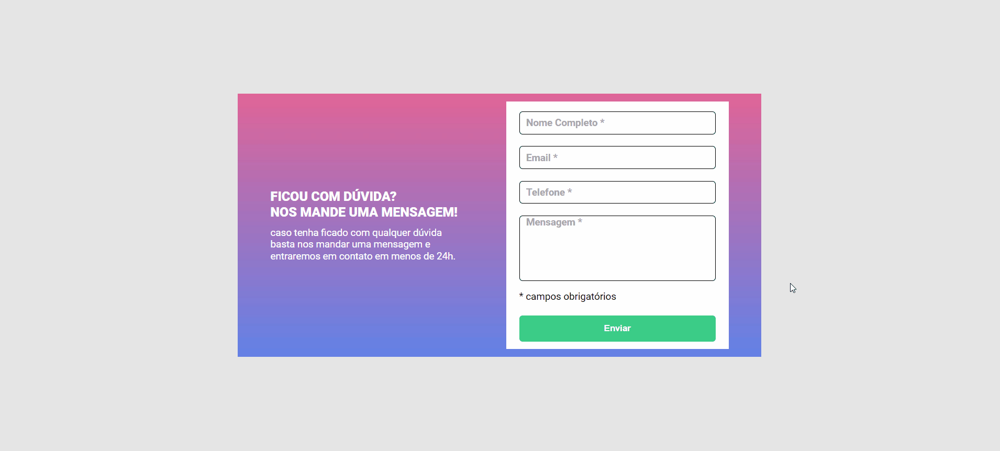

# Formulário

## 📄 Descrição

Formulário com campos obrigatórios caso for preenchido os campos de textos ficam verdes, caso não coloquem nenhum valor nos campos se torna vermelho e uma mensagem de campo obrigatório na tela aparece. Utilizei as tecnologias de HTML5, CSS3 e Javascript obtendo uma ótima oportunidade para aplicar meus conhecimentos adquiridos ao longo do curso do DevQuest.

## 💻 Tecnologias utilizadas

- ``HTML5``
- ``CSS3``
- ``Javascript``

## 📷 Me siga nas redes sociais 

  

